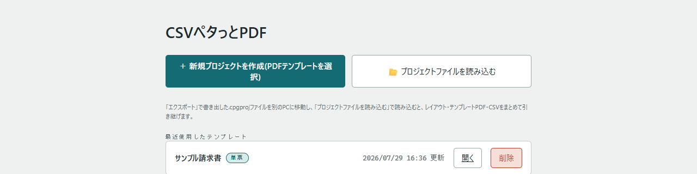
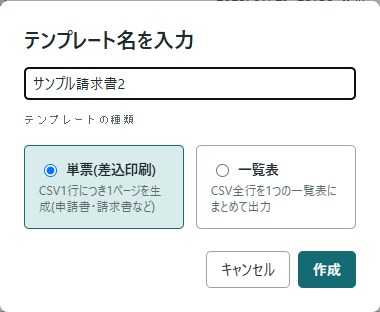
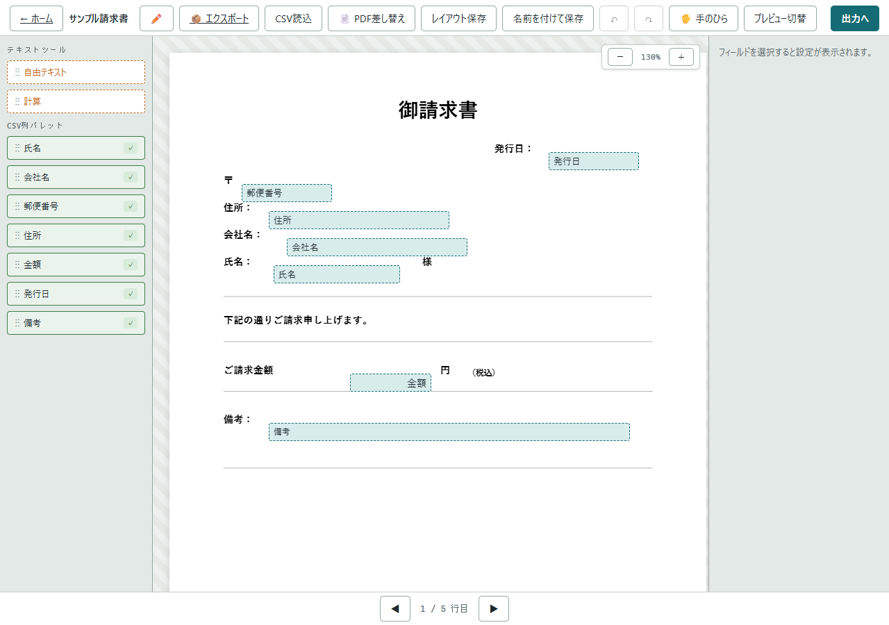
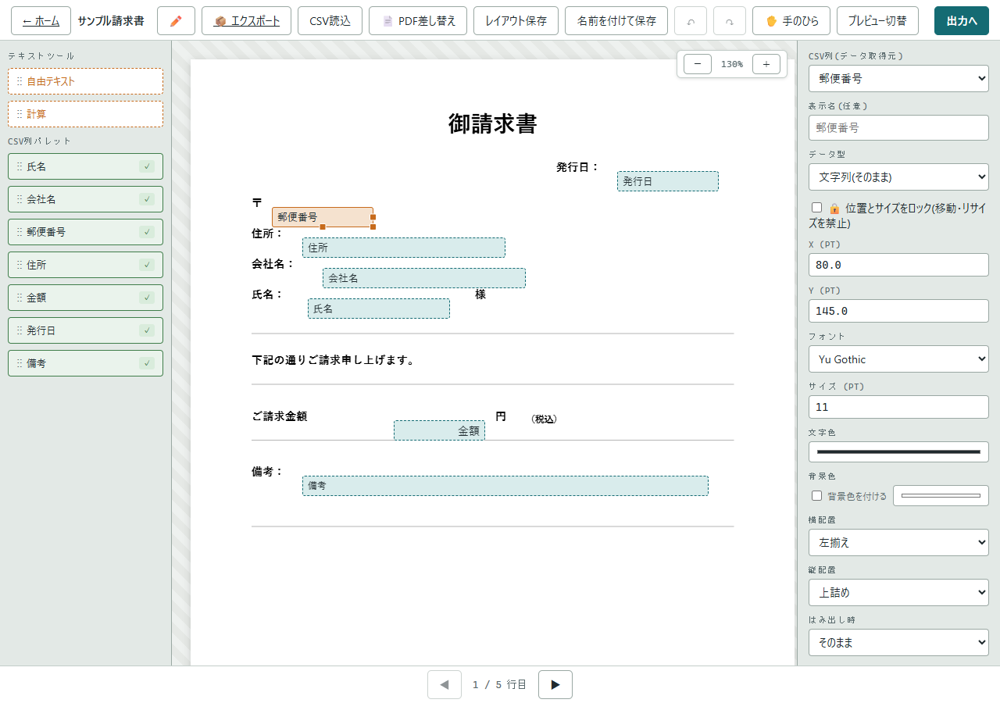
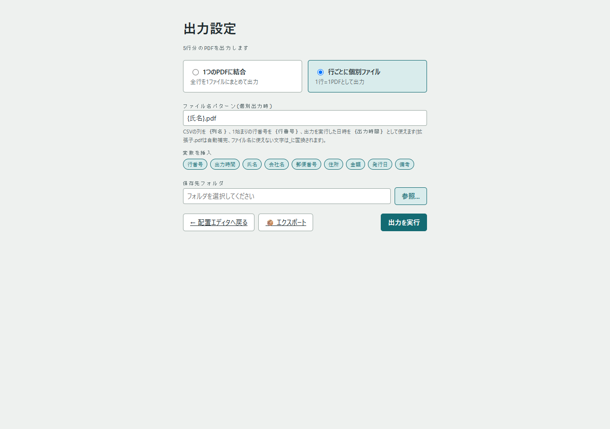
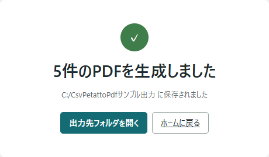

# CSVペタっとPDF 操作マニュアル

CSVの各行データをPDFテンプレートに差し込み、PDFを一括生成するための基本的な使い方を説明します。

## 1. 起動する

配布された `csvpetattopdf.exe` をダブルクリックすると、既定のブラウザでホーム画面が自動的に開きます。特別な操作は不要です。

- インターネット接続は不要です。
- アプリを使い終わったら、開いているブラウザのタブ・ウィンドウを全て閉じてください。数秒〜90秒程度でバックグラウンドのプロセスも自動的に終了します。

## 2. ホーム画面

- **新規プロジェクトを作成**: PDFテンプレートを選んで新しいプロジェクトを作ります。
- **プロジェクトファイルを読み込む**: 他の環境でエクスポート(`.cpgproj`)したプロジェクトを読み込みます。
- 一覧の「開く」から既存のプロジェクトを編集できます。

初めて使う場合は、`samples` フォルダに同梱の `sample-single.pdf`(単票のサンプルPDF)と `dummy_data.csv`(サンプルCSV)を使って、下記の手順をそのまま試してみることをおすすめします。

## 3. 新規プロジェクトを作成する

「新規プロジェクトを作成」を押すとPDFファイルの選択ダイアログが開きます。テンプレートにしたいPDFを選ぶと、名前を入力する画面が表示されます。

- **プロジェクト名**: 一覧に表示される名前です。後から編集画面でいつでも変更できます。
- **テンプレートの種類**
  - **単票(差込印刷)**: CSV1行につき1ページを生成します(請求書・申請書など)。
  - **一覧表**: CSV全行を1つの表にまとめて出力します。

「作成」を押すと配置エディタが開きます。

## 4. 配置エディタでCSVを読み込み、フィールドを配置する

1. ツールバーの「CSV読込」からCSVファイルを選択します(文字コードや区切り文字も指定できます)。
2. 読み込みに成功すると、左側の「CSV列パレット」に列名が並びます。
3. 列名をPDF上にドラッグ&ドロップすると、その位置にCSVの値が差し込まれるフィールドが配置されます。
4. 「自由テキスト」「計算」ツールを使うと、固定文言や計算式のフィールドも配置できます。

配置したフィールドをクリックすると、右側にプロパティパネルが表示され、位置(X・Y)、フォント、サイズ、文字色、データ型ごとの表示形式(日付・数値・真偽値)などを細かく調整できます。

主なツールバーのボタン:

| ボタン | 説明 |
|---|---|
| ✏️ | プロジェクト名を変更 |
| 📦 エクスポート | レイアウト・PDF・CSVを1つのファイル(`.cpgproj`)にまとめて書き出す |
| CSV読込 | CSVファイルを読み込み直す |
| 📄 PDF差し替え | 背景のPDFを別のPDFに差し替える(ページサイズが変わる場合は警告が出ます) |
| レイアウト保存 | 現在の配置を保存する |
| 名前を付けて保存 | 現在の内容をPDFごと新しいプロジェクトとして複製する |
| ↶ / ↷ | 元に戻す・やり直す |
| プレビュー切替 | 実際のCSVデータを差し込んだ見た目を確認する |

画面下の「◀ ▶」でCSVの行を送りながら、プレビューで見た目を確認できます。

配置が終わったら「レイアウト保存」を押して保存し、「出力へ」で出力設定画面に進みます。

## 5. 出力設定

1. **出力モード**を選びます。
   - **1つのPDFに結合**: 全行を1つのファイルにまとめて出力します。
   - **行ごとに個別ファイル**: 1行=1PDFとして出力します。ファイル名パターンを指定できます。
2. ファイル名パターンには、上に並んでいるボタンから「行番号」「出力時間」やCSVの列名をワンクリックで挿入できます。
3. 「参照...」で保存先フォルダを選びます。
4. 「出力を実行」を押すと、進捗が表示されPDFが生成されます。

## 6. 完了

生成が完了すると件数と保存先が表示されます。「出力先フォルダを開く」でエクスプローラーが開き、生成されたPDFを確認できます。「ホームに戻る」で最初の画面に戻ります。

## よくある操作

### プロジェクトを別のPCに持ち出したい

編集画面または出力設定画面の「📦 エクスポート」から `.cpgproj` ファイルを書き出し、別のPCのホーム画面で「プロジェクトファイルを読み込む」から読み込むと、レイアウト・テンプレートPDF・CSVをまとめて引き継げます。

### 似たテンプレートを複製して使いたい

配置エディタの「名前を付けて保存」で、現在の内容を新しいプロジェクトとして複製できます(複製元には影響しません)。

### アプリが起動しない・反応がない

- ZIPを展開せずに実行していないか確認してください(展開してから `csvpetattopdf.exe` を実行してください)。
- タスクマネージャーで `csvpetattopdf.exe` が既に動いていないか確認してください。動いている場合は再度起動すれば自動的に古いプロセスを片付けてから起動します。
- ウイルス対策ソフトにブロック・隔離されていないか確認してください。
- 配置エディタでPDFの背景が表示されない場合、ブラウザにインストールされているPDF関連の拡張機能(PDFビューア系など)が干渉していることがあります。該当する拡張機能を無効にするか、シークレット/InPrivateウィンドウで開いて改善するか確認してください。
